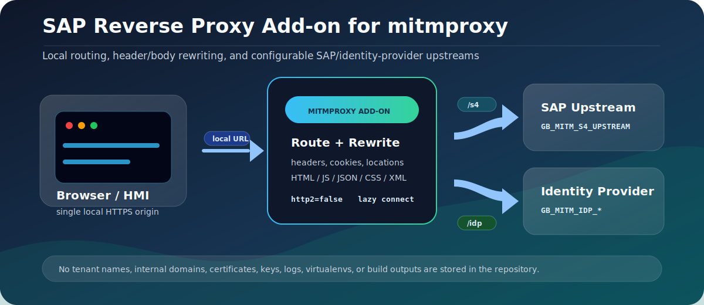

# SAP Reverse Proxy Add-on for mitmproxy

<!--  -->
[](https://raw.githubusercontent.com/michele-tn/SAP-Reverse-Proxy-Add-on-for-mitmproxy/refs/heads/main/assets/project-overview.svg)

This repository contains a Windows-oriented mitmproxy reverse-proxy add-on for SAP web traffic. The add-on routes local URL prefixes to configurable SAP and identity-provider upstreams, rewrites selected headers and response bodies, and provides a local session-reset landing endpoint.

Repository: [michele-tn/SAP-Reverse-Proxy-Add-on-for-mitmproxy](https://github.com/michele-tn/SAP-Reverse-Proxy-Add-on-for-mitmproxy)

All environment-specific values are supplied at runtime. The repository does not include real tenant names, internal hostnames, certificates, private keys, logs, virtual environments, build outputs, or packaged binaries.

## What The Add-on Does

- Routes `/s4/*` traffic to the configured SAP upstream.
- Routes `/idp/*` and `/idp_od/*` traffic to the configured identity-provider upstreams.
- Maps selected root-relative paths such as `/ui`, `/sap`, `/saml2`, `/oauth`, `/login`, and `/universalui`.
- Handles `/`, `/fresh-login`, and `/clear-session` locally by returning a small HTML page that clears browser storage and expires common SAP/identity cookies.
- Handles CORS preflight requests locally.
- Rewrites selected `Origin`, `Referer`, `Location`, `Set-Cookie`, and body URLs so browser traffic stays on the local proxy origin.
- Removes hop-by-hop response headers and selected browser protection headers that would prevent the proxied page from being rendered through the local origin.
- Forces upstream requests to HTTP/1.1 from the add-on logic.

## Repository Contents

```text
.
|-- .gitignore
|-- BuildCompiledProxy.bat
|-- README.md
|-- SetupMitmProxy.bat
|-- StartCompiledProxy.bat
|-- StartMitmProxy.bat
|-- assets/
|   `-- project-overview.svg
|-- certificates/
|   `-- .gitkeep
|-- compiled_proxy_launcher.py
|-- config/
|   `-- env.example.ps1
|-- requirements.txt
|-- run_mitmdump.py
`-- sap_reverse_proxy_mitm.py
```

## Requirements

- Windows.
- Python available as `py -3` or `python`.
- Network access to the configured upstream systems.
- Optional local TLS certificates if the proxy must serve custom HTTPS hostnames.

Installable Python dependencies are listed in `requirements.txt`.

## Configuration

Set the environment variables before starting the proxy. A PowerShell example is provided in `config/env.example.ps1`.

```powershell
$env:GB_MITM_LOCAL_ORIGIN = "https://localhost:1337"
$env:GB_MITM_LOCAL_HOSTNAMES = "localhost,127.0.0.1"
$env:GB_MITM_LISTEN_HOST = "0.0.0.0"
$env:GB_MITM_LISTEN_PORT = "1337"
$env:GB_MITM_S4_UPSTREAM = "https://s4.example.invalid/"
$env:GB_MITM_IDP_UPSTREAM = "https://ias-cloud.example.invalid/"
$env:GB_MITM_IDP_OD_UPSTREAM = "https://ias-ondemand.example.invalid/"
```

Optional certificate arguments can be passed directly to mitmproxy through `GB_MITM_CERTS`:

```powershell
$env:GB_MITM_CERTS = "--certs localhost=certificates\localhost.pem"
```

The PEM file must contain the private key and certificate expected by mitmproxy. Do not commit real certificates, private keys, internal CA files, or environment-specific certificate bundles.

## Run From Source

```bat
StartMitmProxy.bat
```

The script creates `.venv` if needed, installs the dependencies, and runs:

```text
python run_mitmdump.py --set http2=false --set connection_strategy=lazy ...
```

The mitmproxy options are intentionally set by the startup script:

- `http2=false` keeps the upstream side on HTTP/1.1 for this add-on.
- `connection_strategy=lazy` avoids opening an upstream connection before the add-on has had a chance to return local responses.

## Build A Windows Executable

```bat
BuildCompiledProxy.bat
```

The build output is created under:

```text
dist_compiled\GBMitmProxy\
```

The executable still reads runtime configuration from the same `GB_MITM_*` environment variables. The build process in this repository does not bundle real certificates.

## Security Notes

This project can process authenticated browser traffic at runtime. Use it only in environments where you are authorized to inspect and proxy that traffic.

Do not commit:

- certificates or private keys;
- real tenant names or internal domains;
- `.env` files or local configuration files;
- logs, HAR files, packet captures, cookies, SAML assertions, session credentials, or authentication headers;
- compiled packages generated with real local configuration.
